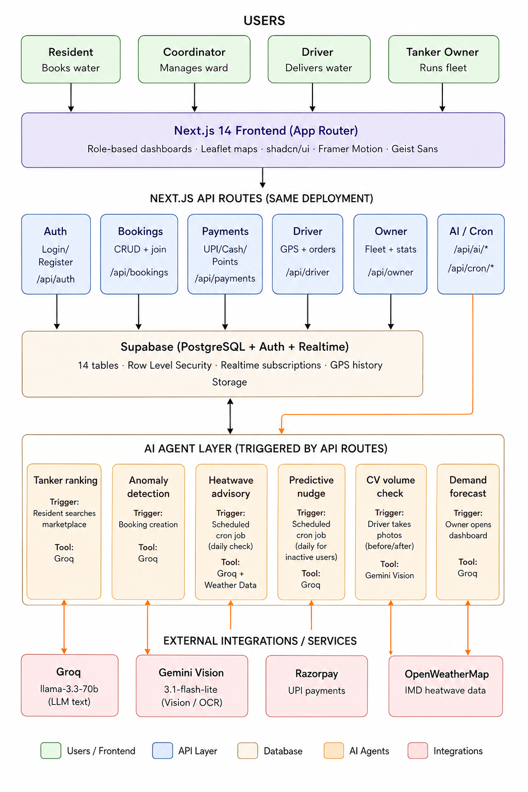
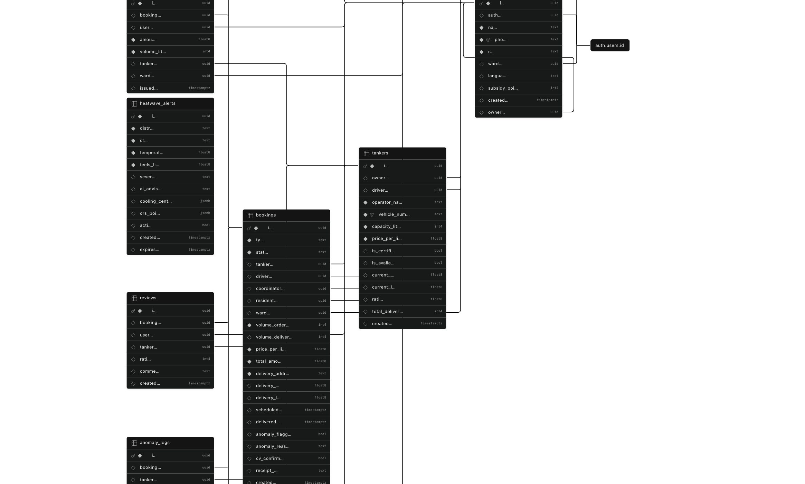

# JalSetu

**Agentic AI Water Delivery Platform for India**

JalSetu (meaning "Water Bridge") is a full-stack platform that digitizes India's water tanker economy. It connects **residents** who need water, **community coordinators** who organize group orders, **drivers** who deliver, and **tanker owners** who manage fleets — all through a single platform powered by AI.

India faces an acute water crisis, especially during summer heatwaves. Most households rely on private water tankers that are overpriced, inconsistent in volume, and lack digital tracking. JalSetu solves this by bringing transparency, automation, and AI verification to the entire delivery lifecycle.

---

## How It Works

### The Problem
- Residents have no way to verify if the tanker delivered the promised volume
- Prices are opaque and vary wildly across wards
- No tracking of deliveries, payments, or disputes
- During heatwaves, demand spikes and supply gets chaotic

### The Solution
1. **Resident books water** from the marketplace, choosing a tanker by price, rating, and capacity
2. **Coordinator organizes** community bookings to get better rates and split bills
3. **Owner assigns a driver** and tanker to the booking
4. **Driver delivers water** and takes before/after photos of the tanker hatch
5. **AI (Gemini Vision) verifies volume** — compares fill levels before and after pumping
6. **If volume is short by >10%**: System automatically raises a dispute, notifies coordinator and resident, driver cannot override
7. **If confirmed**: Driver completes delivery, receipt is generated, payment is released
8. **Resident tracks everything** via GPS, receipts, and real-time status updates

---

## System Architecture

### High-Level Design



### Database Schema (Supabase / PostgreSQL)



### Data Flow Summary

```
Resident / Coordinator          Owner               Driver
       |                         |                    |
       |  Book Water             |                    |
       |------------------------>|                    |
       |                         |  Assign Driver     |
       |                         |------------------->|
       |                         |                    |
       |  Track via GPS          |  GPS Updates       |
       |<--------------------------------------------|
       |                         |                    |
       |                         |    Take Photos     |
       |                         |    (Before/After)  |
       |                         |<-------------------|
       |                         |                    |
       |              CV Volume Verification (AI)     |
       |              Gemini Vision analyzes fill %   |
       |<--------------------------------------------|
       |                         |                    |
       |  Receipt Generated      |  Payment Released  |
       |<--------------------------------------------|
```

---

## Tech Stack

| Layer | Technology | Version | Purpose |
|-------|-----------|---------|---------|
| Framework | Next.js (App Router) | 14.2.35 | SSR + API routes in one framework |
| Language | TypeScript | ^5 | Type safety across full stack |
| Database | Supabase (PostgreSQL + Auth + Realtime) | ^2.110.7 | Auth, DB, realtime subscriptions, RLS |
| AI Text | Groq (llama-3.3-70b-versatile) | - | Fast inference for text-based AI features |
| AI Vision | Google Gemini (gemini-3.1-flash-lite) | ^0.24.1 | Camera-based volume verification |
| Payments | Razorpay (UPI, Cards, Netbanking) | - | India-standard payment gateway |
| Styling | Tailwind CSS | ^3.4.1 | Utility-first CSS for rapid UI |
| Animations | Framer Motion | ^12.42.2 | Smooth page transitions |
| Maps | Leaflet + React-Leaflet | ^1.9.4 | Free, open-source GPS tracking |
| Deployment | Vercel | - | Zero-config Next.js hosting |

---

## Features by Role

### Resident (the water buyer)
- **Marketplace**: Browse all available tankers — see price per liter, capacity, ratings, distance from your ward
- **Booking**: Book water for yourself or start a community group booking
- **Community Bookings**: Join a neighbor's group order to get bulk rates and split the bill automatically
- **GPS Tracking**: Watch your tanker approach in real-time on a Leaflet map, just like tracking a cab
- **CV Volume Verification**: AI analyzes camera photos of the tanker hatch to confirm the actual volume delivered
- **Payments**: Pay via UPI, cash, or subsidy points
- **Receipts**: Automatic digital receipts for every delivery
- **Heatwave Alerts**: Receive alerts when your ward hits extreme temperatures
- **Nudges**: Smart reminders when you might be running low on water based on your usage patterns

### Coordinator (the ward administrator)
- **Community Booking Management**: Create and manage group bookings for your ward
- **Resident Management**: See all residents in your ward, invite them to group orders
- **Dispatch Tankers**: Assign and dispatch tankers for community orders
- **Anomaly Monitoring**: Get instant alerts when price gouging or short deliveries are detected
- **Heatwave Response**: View AI-generated advisories for your ward during heatwaves
- **History**: Full booking and delivery history with status tracking

### Driver (the tanker operator)
- **Active Deliveries**: View your assigned bookings with before/after delivery status
- **Status Updates**: Update delivery status in real-time: En Route > Arrived > Loading > Delivering > Delivered
- **CV Scan**: Take before/after photos of the tanker hatch — AI automatically verifies volume
- **GPS Tracking**: Automatic location sharing so residents can track your approach
- **Delivery History**: Full log of all past deliveries with volume and payment details

### Owner (the tanker business)
- **Fleet Dashboard**: See all your tankers, their current status, and assigned drivers
- **Booking Management**: View incoming booking requests, assign drivers
- **Earnings**: Track revenue, completed deliveries, and average earnings per tanker
- **Demand Forecast**: AI predicts water demand for each ward over the next 7 days — helps you position tankers strategically
- **Reviews**: Monitor driver and tanker ratings from residents
- **Anomaly Alerts**: Get notified of any disputes or flagged deliveries

---

## AI Features

JalSetu uses two AI backends working together:

| AI Backend | Model | Used For |
|------------|-------|----------|
| **Groq** | llama-3.3-70b-versatile | Text tasks: demand forecasting, anomaly detection, tanker ranking, nudge generation, heatwave advisories |
| **Google Gemini** | gemini-3.1-flash-lite | Vision tasks: analyzing tanker photos to estimate water fill levels |

AI wrapper lives in `lib/gemini.ts` — unified interface with retry and exponential backoff for both Groq and Gemini APIs.

---

### Agent 1: CV Volume Verification (Gemini Vision)

**Endpoint:** `POST /api/ai/cv-volume`
**Role:** Driver, Coordinator
**Model:** Gemini 3.1-flash-lite (vision)

Uses computer vision to verify how much water was actually delivered by analyzing photos of the tanker hatch.

**Flow:**
1. Driver takes BEFORE photo (top-down through tanker hatch)
2. Pumps water to customer's tank
3. Takes AFTER photo (same angle)
4. Both photos compressed client-side (max 1024px, JPEG 70%)
5. Sent to `/api/ai/cv-volume` as FormData
6. Server sends both images to Gemini Vision API with fill-estimation prompts
7. AI returns fill percentage for each photo
8. Volume delivered = (before% - after%) x tank_capacity
9. Compared against volume_ordered:
   - Within 10%: **confirmed** — Driver can complete delivery
   - Over 10% short: **short** — System auto-raises dispute
   - Over 10% excess: **excess** — Flagged for review
10. If disputed: coordinator and resident notified via nudge_log, driver cannot override

**Input:** `{ before_image, after_image, volume_ordered, tank_capacity }`
**Output:** `{ verdict, estimated_liters, discrepancy_percent, confidence, before_fill_percent, after_fill_percent }`

---

### Agent 2: AI Tanker Ranking (Groq)

**Endpoint:** `POST /api/ai/rank-tankers`
**Role:** Resident (marketplace)
**Model:** Groq llama-3.3-70b-versatile

Ranks available tankers for a specific ward based on multiple factors, so residents can make informed choices.

**Flow:**
1. Resident searches the marketplace for their ward
2. System fetches all available tankers and recent district booking prices from Supabase
3. Calculates haversine distance from each tanker to the resident's location
4. Sends tanker details + district average price to Groq
5. AI scores each tanker 0-100 based on: price vs. district average, rating, delivery count, distance, and certification
6. Returns ranked list with a short reason (max 8 words) for each ranking

**Input:** `{ ward_id, volume_needed, user_lat, user_lng }`
**Output:** `{ tankers: [{ id, ai_rank_score, ai_rank_reason, ...tanker_details }] }`

---

### Agent 3: Price Gouging Anomaly Detection (Groq)

**Endpoint:** `POST /api/ai/anomaly-check`
**Role:** Coordinator, Owner (monitoring)
**Model:** Groq llama-3.3-70b-versatile

Detects when a tanker is charging significantly more than the district average and protects residents from price gouging during peak demand.

**Flow:**
1. Triggered when a booking is created or reviewed
2. System calculates how far the booking price is above the ward average
3. If >20% above average, sends price data to Groq
4. AI evaluates whether the premium is justified (summer premiums of 20-30% are considered legitimate)
5. Only flags prices >40% above average as anomalies
6. If flagged: logs the anomaly, updates booking with `anomaly_flagged: true`, notifies coordinator

**Input:** `{ booking_id, tanker_id, ward_id, price_per_liter }`
**Output:** `{ is_anomaly, percent_above, reason (max 12 words), severity: "low"|"medium"|"high" }`

---

### Agent 4: Ward Demand Forecasting (Groq)

**Endpoint:** `POST /api/ai/demand-forecast`
**Role:** Owner (fleet planning)
**Model:** Groq llama-3.3-70b-versatile

Predicts water demand for each ward over the next 7 days so tanker owners can position their fleet strategically.

**Flow:**
1. Owner opens the demand forecast dashboard
2. System fetches all wards, last 30 days of bookings, and active heatwave alerts
3. Aggregates per ward stats: pending bookings, total delivered, average price, heatwave status
4. Sends aggregated data to Groq
5. AI analyzes patterns (e.g., heatwave = higher demand, low recent deliveries = unmet need)
6. Returns demand scores (0-100) and predictions for each ward with reasoning

**Input:** None (auto-fetches from database)
**Output:** `{ forecast: [{ ward_id, ward_name, current_demand_score, predicted_demand_tomorrow, pending_bookings, avg_price_paid, reasoning }] }`

---

### Agent 5: Heatwave Advisory Generator (Groq)

**Endpoint:** `POST /api/ai/heatwave-advisory`
**Role:** All users (safety information)
**Model:** Groq llama-3.3-70b-versatile

Generates plain-language heatwave safety advisories tailored to the current weather conditions. Written at a Class 5 reading level so everyone can understand.

**Flow:**
1. Called by the heatwave-check cron job when temperature >= 40 degrees C
2. Sends current temperature, humidity, district, and state to Groq
3. AI generates: severity tier (watch/warning/emergency), 2-sentence advisory, 3 do-items, 2 don't-items, and best outdoor time window
4. Advisory is stored in the `heatwave_alerts` table
5. Displayed to all users in the affected ward via the HeatwaveAlert banner

**Input:** `{ temperature, feels_like, humidity, district, state }`
**Output:** `{ severity: "watch"|"warning"|"emergency", advisory_english, do_list: [3], dont_list: [2], best_time_outdoors }`

---

### Agent 6: Predictive Re-engagement Nudges (Groq)

**Endpoint:** `POST /api/ai/predictive-nudge`
**Role:** Resident engagement (retention)
**Model:** Groq llama-3.3-70b-versatile

Generates personalized messages to re-engage residents who haven't booked water recently — helps prevent water emergencies.

**Flow:**
1. System identifies inactive residents in a ward (no booking in 6+ days, or never ordered)
2. Checks if there is an active heatwave and its severity
3. Sends resident details + heatwave context to Groq
4. AI generates personalized nudge for each resident (e.g., "You last ordered 8 days ago. A heatwave is active in your area. Your tank may be running low.")
5. Nudges are displayed to residents when they open the app

**Input:** `{ ward_id }`
**Output:** `{ nudges: [{ user_id, message, urgency: "low"|"medium"|"high" }] }`


---

## Multi-Ward System

JalSetu is designed for city-scale deployment with ward-based organization:

- Each resident and coordinator is registered to a specific ward
- Bookings, tankers, and demand forecasts are ward-scoped
- Coordinators manage community bookings only within their ward
- AI demand forecasts predict water needs per ward
- Heatwave alerts are ward-specific
- **6 Jaipur wards seeded**: Mansarovar (Ward 12), Vaishali Nagar (Ward 8), Malviya Nagar (Ward 15), Civil Lines (Ward 3), Tonk Road (Ward 20), Jagatpura (Ward 25)

---

## Setup

### Prerequisites
- Node.js 18+
- A Supabase project (free tier works) — provides PostgreSQL database + authentication
- Groq API key (free tier) — for text-based AI features
- Google AI API key (free tier) — for vision-based CV scan
- Razorpay account (optional) — for payment processing

### 1. Clone and Install

```bash
git clone https://github.com/meenakshikr/meesho_jalSetu.git
cd jalsetu
npm install
```

### 2. Environment Variables

Create `.env.local` in the project root:

```bash
# Supabase (from your Supabase project dashboard > Settings > API)
NEXT_PUBLIC_SUPABASE_URL=https://your-project.supabase.co
NEXT_PUBLIC_SUPABASE_ANON_KEY=your-anon-key
SUPABASE_SERVICE_ROLE_KEY=your-service-role-key

# AI — Groq (from console.groq.com)
GROQ_API_KEY=gsk_xxxxxxxxxxxxxxxx

# AI — Google Gemini (from aistudio.google.com)
GOOGLE_AI_API_KEY=AIzaSyxxxxxxxxxxxxxxx

# Razorpay (optional — from dashboard.razorpay.com)
RAZORPAY_KEY_ID=rzp_test_xxxxxxxx
RAZORPAY_KEY_SECRET=xxxxxxxx
NEXT_PUBLIC_RAZORPAY_KEY_ID=rzp_test_xxxxxxxx

# App URL
NEXT_PUBLIC_APP_URL=http://localhost:3000

# Cron secret (for scheduled tasks)
CRON_SECRET=any-random-string
```

### 3. Seed Demo Data

This populates your Supabase database with realistic test data:

```bash
npx tsx scripts/seed-data.ts
```

What gets created:
- **6 Jaipur wards** with names and ward numbers
- **4 tankers** across 2 owners (7500L to 11000L capacity)
- **10 users**: 3 residents (different wards), 4 drivers, 1 coordinator, 2 owners
- **25+ delivered bookings** with GPS coordinates across all wards
- **18+ reviews** for tankers
- **4 active bookings** (one per driver, in various stages)
- **Driver GPS locations** for live tracking
- **Active heatwave alert** for Jaipur (43.5 degrees C)

### 4. Run Development Server

```bash
npm run dev
```

Open [http://localhost:3000](http://localhost:3000).

### Test Accounts (password: `password123`)

| Account | Role | Ward | What to Test |
|---------|------|------|-------------|
| `resident1@test.com` | Resident | Vaishali Nagar Ward 8 | Heatwave banner, nudge card, marketplace with AI ranking, book City Water Co to trigger anomaly |
| `resident2@test.com` | Resident | Mansarovar Ward 12 | Community booking join flow |
| `resident3@test.com` | Resident | Civil Lines Ward 3 | Different ward perspective |
| `coordinator@test.com` | Coordinator | Mansarovar Ward 12 | Create community booking, see residents join in real time |
| `driver@test.com` | Driver | - | Active delivery, CV tank scan, confirm delivery |
| `driver2@test.com` | Driver | - | Additional deliveries |
| `driver3@test.com` | Driver | - | Active delivery to Civil Lines, dispatched status |
| `driver4@test.com` | Driver | - | Active delivery to Jagatpura, confirmed status |
| `owner@test.com` | Owner | - | Fleet dashboard, demand forecast heatmap |
| `owner2@test.com` | Owner | - | Second owner perspective |

### User Guide — Full Feature Walkthrough

Follow this sequence to see every feature working live. Each step shows a different part of the platform.

---

#### Step 1 — Resident Home Screen (AI Features)

**Login as `resident@test.com` (password: `password123`)**

- The home screen immediately shows a **heatwave alert banner** at the top. This is AI-generated. The system detected that Jaipur temperature crossed 40 degrees C and created this alert automatically via a cron job. No human set this up.
- Below the banner, a **predictive nudge card** appears saying water may be running low. The AI estimated days of water remaining based on the resident's last booking date and volume. This nudge was generated by the predictive nudge agent running daily at 6am.
- The dashboard shows the resident's **ward (Vaishali Nagar Ward 8)**, active bookings, and quick actions.
- Both the heatwave banner and nudge are live AI features. Tap them to see the full advisory details.

---

#### Step 2 — Tanker Marketplace (AI Ranking)

**Tap "Book Water" on the resident home screen**

- The marketplace loads **three tankers** sorted by AI rank score (0-100).
- Each tanker card shows: operator name, capacity (liters), price per liter, star rating, and a **teal callout** with the AI's one-line reason for the ranking (e.g., "Best value — 15% below district average").
- **City Water Co** appears at the bottom ranked lowest. The AI flagged it because it charges 177% above the district average price. The ranking reason is visible on the card.
- The ranking is calculated by comparing price vs. district average, rating, delivery count, distance, and certification status — all sent to Groq AI in real time.

---

#### Step 3 — Booking + Anomaly Detection (AI)

**Select City Water Co and tap "Confirm Booking"**

- Enter a delivery address, select volume (e.g., 5000L), and confirm.
- The booking is created and the system **automatically** runs the anomaly detection agent in the background.
- Within 3-5 seconds, a **red "Price Alert Detected" banner** appears on the booking details screen.
- The AI compared the booking price (Rs 2.50/L) against the district average (Rs 0.90/L) and determined it is price gouging — not normal seasonal variation.
- The booking is flagged with `anomaly_flagged: true` in the database. This creates a permanent audit record.
- Tap the banner to see the full anomaly details: district average, charged price, percentage above average, and the AI's reasoning.

---

#### Step 4 — GPS Tracking

**On the same booking, tap "Track Delivery"**

- A **Leaflet map** loads showing the driver's live GPS location as a marker.
- The map auto-fits to show both the driver's current position and the delivery destination.
- If the driver is en route, the marker moves in real time as the driver's GPS updates are submitted.
- The driver's name and tanker details are shown below the map.
- Tap the navigation button to open Google Maps directions to the delivery address.

---

#### Step 5 — Community Booking + Realtime (Coordinator + Resident)

**Open a new browser tab. Login as `coordinator@test.com`**

- The coordinator dashboard shows their ward (Mansarovar Ward 12), active community bookings, and a "Create Community Booking" button.
- Tap "Create Community Booking" — enter a delivery address, select tanker, set volume, and confirm.
- The community booking is created and appears on the coordinator dashboard with "0 participants".

**Switch to a third browser tab. Login as `resident2@test.com`**

- This resident is in Mansarovar Ward 12 (same ward as the coordinator).
- They see the community booking on their dashboard and can tap "Join Booking".
- Select their share of water (e.g., 2000L) and confirm.

**Switch back to the coordinator tab**

- **Without refreshing the page**, the participant count updates from 0 to 1 in real time. The resident's name and share appear instantly.
- This works via **Supabase Realtime subscriptions** — the coordinator's browser is listening for database changes and updates the UI automatically.
- The coordinator can see the total liters requested, total participants, and bill split per household.

---

#### Step 6 — Driver Delivery + GPS Tracking

**Login as `driver@test.com`**

- The driver dashboard shows active deliveries with status tabs: "To Deliver" and "Completed".
- An active delivery to Vaishali Nagar appears with the customer's name, address, volume ordered, and amount.
- Tap the delivery to open the delivery details page.
- The page shows a **live Leaflet map** tracking the driver's GPS position. The driver's location is sent to the server every few seconds.
- A "Navigate" button opens Google Maps with directions to the customer.
- The driver can update their status: "En Route" > "Arrived" > "Loading" > "Delivering".
- Each status update is reflected in real time on the resident's tracking page.

---

#### Step 7 — CV Volume Verification (AI Vision)

**On the driver delivery page, tap "Scan Tank"**

- The **CV Scanner** opens with a guided two-step flow:
  - **Step 1**: "Photo 1 of 2 — Before Delivery". Tap to open the camera. Take a top-down photo through the tanker hatch. The photo is compressed client-side (max 1024px, JPEG 70%) to reduce upload size. Tap "Confirm & Next".
  - **Step 2**: "Photo 2 of 2 — After Delivery". Take the same angle photo after pumping water. Tap "Analyze Volume".
- Both photos are sent to `/api/ai/cv-volume` as FormData.
- **Gemini Vision** analyzes both photos, estimating the fill percentage of the tank from each image.
- The result appears in 3-5 seconds:
  - **Before fill %** and **After fill %**
  - **Estimated liters delivered** = (before% - after%) x tank capacity
  - **Discrepancy** vs ordered volume
  - **Confidence level** (high/medium/low)
  - **Verdict**: "confirmed" (within 10%), "short" (>10% under), or "excess" (>10% over)

**If verdict is "confirmed":**
- A green "Volume Verified" card appears.
- The driver taps "Confirm Delivery" to navigate to the confirm page.

**If verdict is "short":**
- A red "Short Delivery Detected" card appears automatically.
- The system **auto-raises a dispute** — the driver cannot dismiss or override it.
- A notification is sent to both the coordinator and resident via the nudge_log table.
- The "Complete Delivery" button is disabled with the message "Disputed — Cannot Complete".
- The driver sees: "Dispute raised automatically. Coordinator and resident have been notified. You cannot override this."

---

#### Step 8 — Delivery Confirmation + Receipt

**On the confirm page (after CV scan shows "confirmed")**

- The page shows: customer details, delivery address, volume ordered, and total amount.
- The **CV scan results** are displayed: estimated liters, ordered liters, discrepancy, confidence.
- If payment was via UPI, it shows payment status. If cash, the driver taps "Mark Cash Received" to confirm collection.
- The driver taps **"Complete Delivery"**.
- The system sets the booking status to "delivered" and **automatically generates receipts** — one per household for community bookings, one per booking for individual bookings.
- The resident can now see their receipt in the booking details page.

---

#### Step 9 — Owner Fleet Dashboard

**Login as `owner@test.com`**

- The owner dashboard shows their **fleet overview**: all tankers, assigned drivers, and current status.
- Each tanker card shows: name, capacity, assigned driver, vehicle number, rating, and total deliveries.
- The **earnings section** shows total revenue, completed deliveries, and average earnings per tanker.
- The owner can see incoming booking requests and assign drivers to bookings.

---

#### Step 10 — AI Demand Forecast

**On the owner dashboard, tap "Demand Forecast"**

- The AI has analyzed all ward booking patterns, heatwave data, and historical trends.
- A **ward-level demand prediction** appears: each ward is ranked by predicted demand for tomorrow.
- Wards are displayed with **color-coded bars**: teal for high demand, amber for medium, slate for low.
- Each ward shows: current demand score (0-100), predicted demand tomorrow, pending bookings, average price paid, and the AI's one-line reasoning.
- This helps tanker owners position their fleet strategically — similar to how Ola drivers use surge pricing maps.

---

#### Step 11 — Coordinator Anomaly Monitoring

**Login as `coordinator@test.com`**

- The coordinator dashboard shows any **anomaly alerts** for their ward.
- If a booking was flagged by the anomaly agent (from Step 3), a red warning badge appears.
- The coordinator can tap into the anomaly to see: booking details, price charged, district average, percentage above average, and the AI's reasoning.
- The coordinator can escalate or resolve the anomaly from this screen.

---


#### Step 13 — Tanker Reviews

**Login as `resident1@test.com` or `resident3@test.com`**

- After a delivery is completed, the resident can leave a **star rating and comment** for the tanker.
- Reviews are visible on the tanker detail page in the marketplace.
- Reviews feed back into the AI ranking agent — tankers with higher ratings rank better.

---

#### Step 14 — Delivery History

**Login as any driver, resident, or coordinator**

- Each role has a **History** page showing all past deliveries.
- Drivers see: delivery address, volume, status, date, and payment status.
- Residents see: tanker name, volume received, amount paid, receipt status, and whether CV verified.
- Coordinators see: all bookings in their ward with participant counts and delivery status.

---


### AI Features Summary

| Step | AI Agent | Model | Trigger |
|------|----------|-------|---------|
| 1 | Heatwave Advisory | Groq llama-3.3-70b | Cron job (every 6 hours) |
| 1 | Predictive Nudge | Groq llama-3.3-70b | Cron job (daily 6am) |
| 2 | Tanker Ranking | Groq llama-3.3-70b | Marketplace page load |
| 3 | Anomaly Detection | Groq llama-3.3-70b | Booking creation |
| 7 | CV Volume Verification | Gemini 3.1-flash-lite | Driver takes photos |
| 10 | Demand Forecast | Groq llama-3.3-70b | Owner opens dashboard |

---

### Tech Stack Quick Reference

| Layer | Technology | Why |
|-------|-----------|-----|
| Framework | Next.js 14 (App Router) | SSR + API routes in one deployment |
| Language | TypeScript | Type safety across full stack |
| Database | Supabase (PostgreSQL) | Auth, realtime, RLS, hosted |
| AI Text | Groq (llama-3.3-70b) | Free, fast, unlimited on free tier |
| AI Vision | Gemini 3.1-flash-lite | Image analysis for CV scan |
| Payments | Razorpay | UPI, cards, netbanking for India |
| Styling | Tailwind CSS | Dark navy UI with teal accents |
| Maps | Leaflet + React-Leaflet | Free, no API key needed |
| Deployment | Vercel | Zero-config, auto-deploy from GitHub |

---


## Project Structure

```
jalsetu/
├── app/
│   ├── (auth)/                 # Login and register pages
│   │   ├── login/
│   │   └── register/
│   ├── api/
│   │   ├── ai/                 # AI-powered endpoints (6 total)
│   │   │   ├── anomaly-check/  # Price gouging detection
│   │   │   ├── cv-volume/      # Camera volume verification
│   │   │   ├── demand-forecast/# Ward-level demand prediction
│   │   │   ├── heatwave-advisory/ # Safety advisories
│   │   │   ├── predictive-nudge/  # Re-engagement messages
│   │   │   └── rank-tankers/   # AI tanker recommendations
│   │   ├── auth/               # Login, logout, register, current user
│   │   ├── bookings/           # Booking CRUD, detail, join endpoint
│   │   ├── community-bookings/ # Community booking queries
│   │   ├── cron/               # Scheduled tasks (heatwave, nudges)
│   │   ├── driver/             # Driver bookings, tankers, GPS location
│   │   ├── heatwave/           # Heatwave alert queries
│   │   ├── nudges/             # Nudge log retrieval and read
│   │   ├── owner/              # Fleet, bookings, assign driver, stats
│   │   ├── payments/           # Razorpay orders, webhooks, cash marking
│   │   ├── receipts/           # Receipt generation and retrieval
│   │   ├── reviews/            # Tanker reviews
│   │   ├── tankers/            # Tanker CRUD
│   │   ├── users/              # User listing
│   │   └── wards/              # Ward listing
│   ├── coordinator/            # Coordinator pages
│   │   ├── anomaly/[id]/       # Anomaly detail
│   │   ├── assign/[id]/        # Driver assignment
│   │   ├── booking/[id]/       # Booking detail
│   │   ├── create/             # Create community booking
│   │   ├── delivery/[id]/      # Delivery tracking
│   │   ├── history/            # Booking history
│   │   └── nudges/             # Nudge management
│   ├── driver/                 # Driver pages
│   │   ├── confirm/[id]/       # Confirm delivery with CV
│   │   ├── delivery/[id]/      # Delivery progress
│   │   └── history/            # Delivery history
│   ├── owner/                  # Owner pages
│   │   ├── bookings/           # Booking management
│   │   ├── demand/             # Demand forecast
│   │   ├── fleet/              # Fleet management
│   │   └── reviews/            # Tanker reviews
│   └── resident/               # Resident pages
│       ├── booking/[id]/       # Booking detail
│       ├── community/          # Community bookings
│       ├── delivery/[id]/      # Delivery tracking
│       ├── marketplace/        # Tanker marketplace
│       ├── payment/[id]/       # Payment flow
│       └── tracking/[id]/      # Live GPS tracking
├── components/                 # Reusable UI components
│   ├── BillSplit.tsx           # Community bill splitting
│   ├── BookingStatus.tsx       # Booking status tracker
│   ├── BottomNav.tsx           # Mobile bottom navigation
│   ├── CVScanner.tsx           # Camera volume verification
│   ├── HeatwaveAlert.tsx       # Heatwave alert banner
│   ├── LoadingBar.tsx          # Top loading progress bar
│   ├── MapView.tsx             # Leaflet map with routes and markers
│   ├── ReceiptCard.tsx         # Receipt display
│   ├── TankerCard.tsx          # Tanker info card
│   └── ui/                     # shadcn/ui primitives
├── contexts/
│   └── ThemeContext.tsx         # Theme provider context
├── hooks/
│   ├── useBooking.ts           # Booking state hook
│   ├── useHeatwave.ts          # Heatwave alert hook
│   └── useLocation.ts          # GPS location hook
├── lib/
│   ├── compress-image.ts       # Client-side image compression for CV scan
│   ├── gemini.ts               # Groq (text) + Gemini (vision) AI wrapper
│   ├── geocode.ts              # Nominatim geocoding utility
│   ├── razorpay.ts             # Razorpay client
│   ├── supabase-client.ts      # Browser Supabase client
│   ├── supabase-server.ts      # Server + service role Supabase clients
│   └── utils.ts                # INR formatting, haversine distance, etc.
├── scripts/
│   ├── seed-data.ts            # Main seed script
│   └── seed-jaipur.js          # Extended Jaipur seed data
├── supabase/
│   └── migrations/             # SQL migrations
├── test-pictures/              # HLD diagrams and test images
├── types/
│   └── index.ts                # TypeScript type definitions
├── middleware.ts                # Next.js middleware (auth + routing)
└── vercel.json                 # Vercel deployment config + cron schedules
```

---

## API Routes

### Authentication
| Method | Endpoint | Description |
|--------|----------|-------------|
| POST | `/api/auth/register` | Register new user (ward required for resident/coordinator) |
| POST | `/api/auth/login` | Sign in |
| POST | `/api/auth/logout` | Sign out |
| GET | `/api/auth/me` | Get current user profile with ward |

### Bookings
| Method | Endpoint | Description |
|--------|----------|-------------|
| GET | `/api/bookings` | List bookings (filterable by ward, status, type, resident) |
| POST | `/api/bookings` | Create a new booking (auto-geocodes address) |
| GET | `/api/bookings/[id]` | Get booking details with tanker, driver, participants |
| PATCH | `/api/bookings/[id]` | Update booking status, assign driver. Auto-generates receipts on delivery. Auto-raises disputes and notifies coordinator + resident on short delivery. |
| POST | `/api/bookings/[id]/join` | Join a community booking |

### Driver
| Method | Endpoint | Description |
|--------|----------|-------------|
| GET | `/api/driver/bookings` | Get bookings for the authenticated driver |
| GET | `/api/driver/tankers` | Get tankers assigned to the authenticated driver |
| POST | `/api/driver/location` | Submit GPS location for live tracking |
| GET | `/api/driver/location/[driverId]` | Get driver GPS location and history |

### Owner
| Method | Endpoint | Description |
|--------|----------|-------------|
| GET | `/api/owner/bookings` | Owner bookings across fleet |
| PATCH | `/api/owner/bookings/[id]/assign` | Assign driver to booking |
| GET | `/api/owner/fleet` | Fleet overview with tanker and driver stats |
| GET | `/api/owner/stats` | Earnings and delivery statistics |

### Tankers
| Method | Endpoint | Description |
|--------|----------|-------------|
| GET | `/api/tankers` | List tankers (filterable by ward, owner) |
| POST | `/api/tankers` | Add a new tanker |
| GET | `/api/tankers/[id]` | Get tanker details with reviews |

### Payments
| Method | Endpoint | Description |
|--------|----------|-------------|
| POST | `/api/payments` | Create Razorpay order |
| POST | `/api/payments/webhook` | Razorpay webhook handler |
| POST | `/api/payments/[id]/cash` | Mark cash payment as received |

### Receipts and Reviews
| Method | Endpoint | Description |
|--------|----------|-------------|
| GET | `/api/receipts` | List receipts for current user |
| GET | `/api/receipts/[id]` | Get receipt details |
| POST | `/api/reviews` | Submit a tanker review with rating |
| GET | `/api/reviews/tanker/[id]` | Get reviews for a specific tanker |

### AI
| Method | Endpoint | Description |
|--------|----------|-------------|
| POST | `/api/ai/rank-tankers` | AI-ranked tanker recommendations for a ward |
| POST | `/api/ai/anomaly-check` | Price/volume anomaly detection |
| POST | `/api/ai/cv-volume` | Computer vision volume verification from photos |
| POST | `/api/ai/heatwave-advisory` | Heatwave advisory generation |
| POST | `/api/ai/demand-forecast` | Ward-level 7-day demand prediction |
| POST | `/api/ai/predictive-nudge` | Personalized re-engagement nudges |

### Other
| Method | Endpoint | Description |
|--------|----------|-------------|
| GET | `/api/wards` | List all wards |
| GET | `/api/heatwave` | Get active heatwave alerts |
| GET | `/api/nudges` | Get user unread nudges |
| PATCH | `/api/nudges/[id]/read` | Mark nudge as read |
| GET | `/api/users` | List users (filterable by role) |
| GET | `/api/community-bookings` | List community bookings |
| GET | `/api/cron/heatwave-check` | Scheduled heatwave monitoring (daily) |
| GET | `/api/cron/coordinator-nudge` | Scheduled nudge dispatch (daily) |

---

## Deployment

### Vercel (Production)

1. Push to GitHub
2. Import project on Vercel
3. Add environment variables in Vercel Dashboard > Settings > Environment Variables
4. Deploy — Vercel auto-deploys on every push to main
5. Disable Vercel Authentication in Deployment Protection settings so anyone with the link can access


---

## License

MIT
